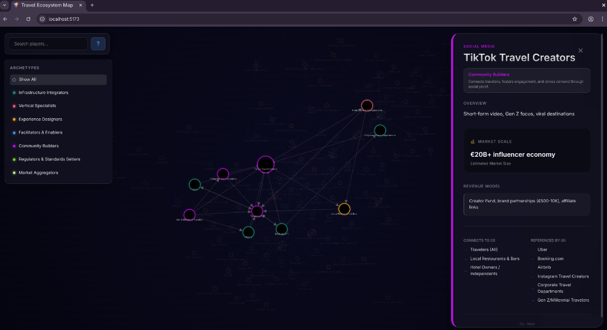

# 🌍 Travel Ecosystem Map



> An interactive, force-directed graph visualization of the global travel and tourism ecosystem, mapping 120+ players across 7 archetypes.

## ✨ Features

*   **Interactive Force-Directed Graph**: Built with **D3.js**, featuring smooth physics simulations, zooming, panning, and dragging.
*   **Premium Dark Mode UI**: A sleek, glassmorphism-inspired interface with neon glow effects and responsive design.
*   **Smart Search & Filtering**: Instantly find players or filter by specific industry archetypes (e.g., Infrastructure, Experience Designers).
*   **Real-World Data Contrast**: Compares model-generated data with **verified 2024/2025 financial reports** for major players like Uber, Ryanair, and Booking.com.
*   **Rich Information Panels**: Click any node to reveal detailed insights, revenue models, and connection maps.
*   **Educational Context**: Built-in guides explaining the role of each player type in the industry.

## 🛠️ Tech Stack

*   **Core**: [React](https://reactjs.org/) (TypeScript)
*   **Visualization**: [D3.js](https://d3js.org/)
*   **Build Tool**: [Vite](https://vitejs.dev/)
*   **Styling**: CSS Modules with Glassmorphism effects

## 🚀 Getting Started

1.  **Clone the repository**
    ```bash
    git clone https://github.com/yourusername/travel-ecosystem-map.git
    cd travel-ecosystem-map
    ```

2.  **Install dependencies**
    ```bash
    npm install
    ```

3.  **Run locally**
    ```bash
    npm run dev
    ```
    Open `http://localhost:5173` in your browser.

## 📖 How to Read the Map

*   **Nodes (Circles)**: Represent key players (Airlines, OTAs, Banks, etc.).
*   **Links (Lines)**: Represent business relationships and capital flow.
*   **Colors**: Indicate the player's "Archetype" or role in the ecosystem.
*   **Size**: Larger nodes indicate higher connectivity or market dominance.

## 🤝 Contributing

Contributions are welcome! Please feel free to submit a Pull Request.

## 📄 License

This project is licensed under the MIT License.
